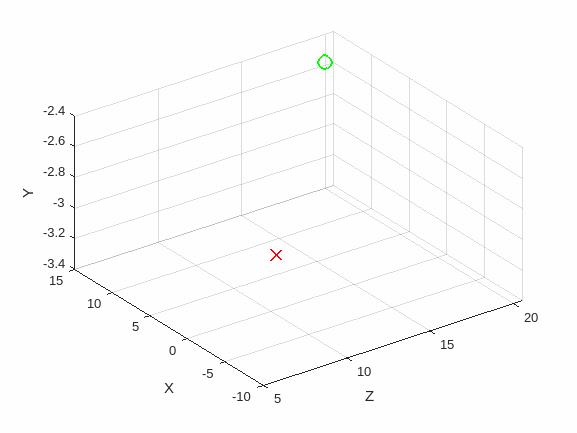
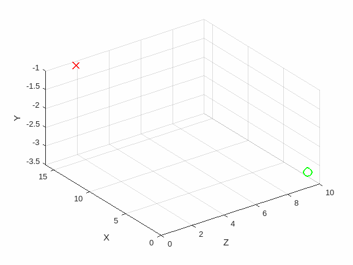
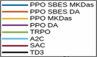
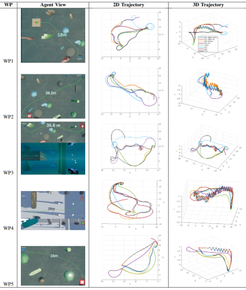

# Advancing Map-less Underwater Navigation

## Research Question
How can the performance and robustness of map-less underwater navigation for low-cost underwater robots be enhanced by comparing and integrating Advanced Actor-Critic (A2C), Proximal Policy Optimization (PPO), and Trust Region Policy Optimization (TRPO) algorithms, while addressing the challenge of navigation failure in constrained environments?

## Project Overview
This research investigates the efficacy of various reinforcement learning algorithms, including Actor-Critic with Experience Replay (A2C), Proximal Policy Optimization (PPO), and Trust Region Policy Optimization (TRPO), to enhance the navigation capabilities of low-cost underwater robots. The focus is on developing a robust and resilient navigation system integrating advanced sensor fusion techniques for improved depth perception and obstacle avoidance. The project also explores the refinement of reward functions to recover effectively from navigation failures, ensuring consistent progress toward designated goals in diverse underwater environments.

## Key Components
- **Unity Environment**: Development of a Unity-based simulation environment for training and testing the reinforcement learning models.
- **3D Modeling**: Design and integration of detailed 3D models for underwater robots and environments within the Unity framework.
- **ROS Integration**: Utilization of ROS Melodic on Ubuntu 18.04 for real-world application and testing of trained models.
- **Reinforcement Learning Models**: Implementation and comparison of A2C, PPO, and TRPO algorithms for underwater navigation.

## Setup Instructions

### Steps to Build the Unity Project:

1. **Open the Project in Unity**:
   - Launch Unity Hub and add the `Water` project by navigating to the location `/home/ether/Documents/Robotics_Navigation/underwater_env/Water`.
   - Open the project in the Unity Editor.

2. **Build the Project**:
   - Within Unity, go to `File` > `Build Settings`.
   - Select your target platform (for example, Linux if you're on Ubuntu).
   - Click on `Build And Run` or `Build` if you want to just build without running.
   - Choose an output directory where the executable will be placed. You could create a new folder within the `underwater_env` directory, like `Water`, and select that.

3. **Verify the Build**:
   - After the build process is complete, navigate to the output directory you selected (e.g., `/home/ether/Documents/Robotics_Navigation/underwater_env/Water`).
   - Ensure there is an executable file for the Unity environment.
     
### Virtual Environment Setup
Create a Python 3.8 virtual environment named `ROV`:
```bash
conda create --name ROV python=3.8
```

Activate the virtual environment:
```bash
conda activate ROV
```
Install the required dependencies:
```bash
pip install -r requirements.txt
```

### CUDA 12.1 (Optional)
```bash
pip install torch==2.1.0 torchvision==0.16.0 torchaudio==2.1.0 --index-url https://download.pytorch.org/whl/cu121
```
### ML-Agents Setup
Clone the ML-Agents repository and navigate to it:
```bash
git clone --branch release_18 https://github.com/Unity-Technologies/ml-agents.git
cd ml-agents
```

Install the `ml-agents-envs` and `gym-unity` packages:
```bash
pip install -e ./ml-agents-envs
pip install gym-unity==0.27.0
```
Later you might encounter error is due to the deprecation of the `np.bool` alias in NumPy. To resolve this, you can modify the code where `np.bool` is being used to simply use `bool` instead. Locate the file `BlueROV_Navigation-Control/ml-agents/ml-agents-envs/mlagents_envs/rpc_utils.py` and go to line 376, 392 and 400 where `np.bool` is being used. Change `np.bool` to `bool`. 
```python
dtype=bool,
```

### Training and Testing
For training the models, run:
```bash
python3 ppo_gym.py --save-model-interval 5 --env-name navigation --eval-batch-size 0 --min-batch-size 2048 --num-threads 1 --hist-length 5
```

For testing the models, run:
```bash
python3 ppo_gym_test.py --env-name navigation --eval-batch-size 2000 --hist-length 5
```
<!-- ## Research Findings and Contributions
This project contributes to the field of underwater robotics by:
- Comparatively analyzing the performance of A2C, PPO, and TRPO in map-less navigation scenarios.
- Enhancing the robustness of underwater navigation systems through advanced sensor fusion and reward function refinement.
- Providing insights into overcoming navigation failures in constrained underwater environments.
-->

### Running on cluster
Install wireguard to you local machine:
   ```bash
   sudo apt install wireguard
   ```
Up the wiregrad interface
   ```bash
   sudo wg-quick up ~/Downloads/mdeowan698.conf
   ```
Connect with cluster for hosting VS Code:
   ```bash
   srun --time=05:00:00 --gres=gpu:1 --mem=64G --partition=mundus --pty bash -l
   ```
Adjust host configuration based on the node requirements.
To monitor the process usage, execute: htop --user <user_id>.

Connect with cluster:
   ```bash
   ssh <<username>>@sms.lis-lab.fr
   ```
Create a new Conda environment:
   ```bash
   conda create --name <env-name>
   ```
Activate the Conda environment:
   ```bash
   conda activate <env-name>
   ```
Install Python 3.6:
   ```bash
   conda install python=3.8
   ```
Install gdown for downloading files from Google Drive:
   ```bash
   pip install gdown
   ```
Downloading Files from Google Drive
To download files from Google Drive, you can use the `gdown` command followed by the file ID:
```bash
gdown --id <file_id>
```
Running Jupyter Notebook Locally

To run Jupyter Notebook locally, you can use SSH tunneling:
```bash
ssh -N -L 8888:localhost:8888 mdeowan698@sms.lis-lab.fr
```
Then access Jupyter Notebook in your web browser using:
```
http://localhost:8888/
```
Install project dependencies follow Environment Setup


### Modificaion for running on Cluster

Set UnityEnvironment() parameter, Underwater_navigation class line around 320
```python
no_graphics=True
```
### Running on Cluster GPU

Before running your code on the Cluster GPU, please ensure that a GPU is available and allocate the necessary resources.

### Check GPU Availability

To check the availability of GPUs on the cluster, run:

```bash
info-cluster
```

### Select GPU and Allocate Time

Once you've verified GPU availability, select a specific GPU and allocate the desired runtime using the following command:

```bash
srun --time=02:00:00 --gres=gpu:1 --partition=mundus --mem=64G --pty bash -l
```

Replace `--gres=gpu:1` with the number of GPUs you need, `--partition=mundus` with the appropriate partition, and adjust `--time` and `--mem` as needed.

### GPU Status

To check the status of the GPU, use the following command:

```bash
nvidia-smi
```

### Additional Commands

- Check GPU status for a specific GPU type:
  ```bash
  srun --time=02:00:00 --gres=gpu:2080:1 --partition=all --mem=64G --pty bash -l
  ```

- View queued jobs for a specific user:
  ```bash
  squeue --user  mdeowan698
  ```
  
- Submit a job file using `.slurm` file:
  ```bash
  sbatch <file_name>
  ```

- Cancel the job
  ```bash
  scancel <job_id>
  ```

## Result

Below are six GIFs that demonstrate the results of the navigation control system.

<div align="center">
  <table>
    <tr>
      <td></td>
      <td></td>
      <td></td>
    </tr>
    <tr>
      <td></td>
      <td></td>
      <td></td>
    </tr>
  </table>
   
</div>


## Acknowledgments
Special thanks to Prof. Ricard Marxer for supervising this project and the University of Toulon for providing the necessary resources and support. Additionally, gratitude is extended to the open-source communities of ROS, Unity, and ML-Agents for their invaluable tools and frameworks.
